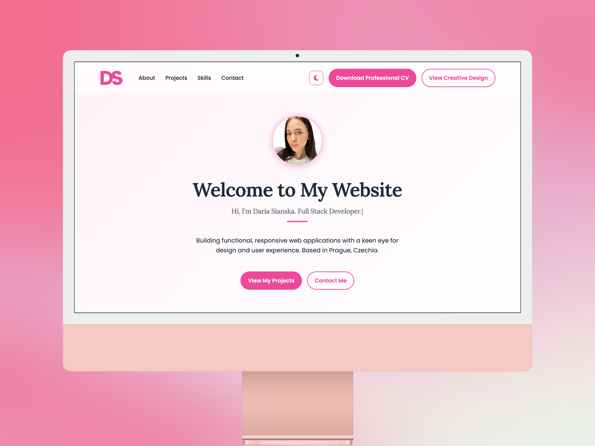

# 🌟 Personal Portfolio — Daria Sianska

[](https://dariasyanska.github.io/portfolio/)
[](https://developer.mozilla.org/en-US/docs/Web/HTML)
[](https://developer.mozilla.org/en-US/docs/Web/CSS)
[](https://developer.mozilla.org/en-US/docs/Web/JavaScript)


## ✨ About the Project

This is my personal portfolio website showcasing my work as a **Frontend Developer** with a strong focus on **UI/UX design**.

The goal of this project is to combine clean code, modern interface design, and smooth user experience — aligned with real-world product standards.

---

## 🚀 Key Features

- 🌓 **Dark / Light Mode**  
  Persistent theme switching using `localStorage`.

- 📱 **Responsive Design**  
  Mobile-first layout optimized for all screen sizes.

- 🎨 **UI/UX Focus**  
  Clean layout, strong typography, and attention to visual hierarchy.

- 📩 **Contact Form Integration**  
  Powered by Formspree for handling submissions.

- ⚡ **Performance Optimization**  
  Optimized images (WebP), clean and efficient JavaScript, and well-structured, maintainable CSS architecture.

---

## 🛠️ Tech Stack

**Frontend**
- HTML5 (semantic markup)
- CSS3 (BEM methodology, CSS variables, responsive design)
- JavaScript (ES6+)

**Design**
- Figma (wireframes, UI, prototyping)

**Libraries**
- [AOS](https://michalsnik.github.io/aos/) — scroll animations  
- [Typed.js](https://mattboldt.github.io/typed.js/) — typing effect  
- [FontAwesome](https://fontawesome.com/) — icons  

---

## 🎯 What This Project Demonstrates

- Ability to build a fully responsive UI from scratch  
- Strong understanding of UI/UX and visual hierarchy  
- Clean and maintainable CSS architecture (BEM)  
- Implementation of interactive and dynamic UI features  
- Focus on performance and accessibility  

---

## 📂 Project Structure

```text
/
├── index.html           # Main landing page (portfolio overview)
├── success.html         # Confirmation page after form submission
├── contract.html        # Terms of cooperation / contract details
├── hire-me.html         # Contact & collaboration page (lead capture)
├── privacy.html         # Privacy policy (GDPR compliance)
├── terms.html           # Terms & conditions of website usage
├── css/
│   └── styles.css       # Core styling (themes, layout, responsiveness)
├── js/
│   └── script.js        # UI logic (dark/light mode, scroll animations, AOS)
├── images/              # Optimized assets (WebP, UI previews, icons)
└── CV_Daria_Sianska.pdf # Downloadable CV / resume
